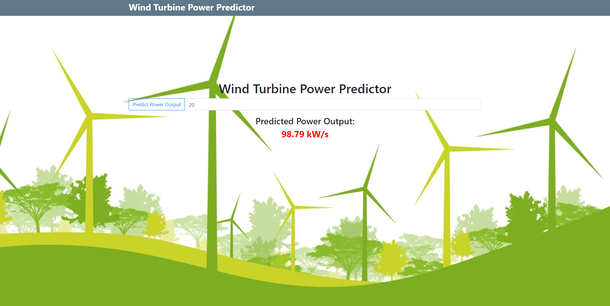
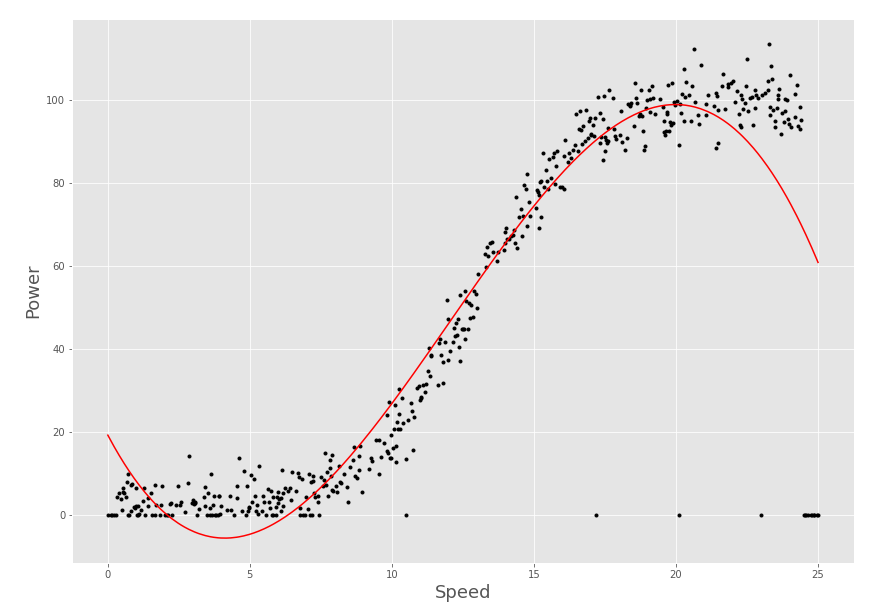

# Emerging Technology Project
## Project Overview

This is a repository for my Emerging Technologies module, for which I will create a web application using Flask that utilizes a machine learning model to accurately predict wind turbine power output from wind speed.

## How to Run *with* Docker
* Download the latest version of Docker
* Navigate into the flask-web-application directory: `cd flask-web-application`
* `docker build -t emerging-tech-project .`
* `docker run -d -p 5000:5000 emerging-tech-project`

## How to Run *without* Docker
* Download the latest version of python 3
* Navigate into the flask-web-application directory: `cd flask-web-application`
* Project dependencies: `pip install -r requirements.txt`
* Set python file to run flask from: `set FLASK_APP=run.py`
* Run local Flask server: `python -m flask run`

## How to Use
* Simply enter wind speed in m/s in the input box.
* Hit the *Predict Power Output* button to the left of input box.
* The predicted power output will now be displayed below.

## Example

## Research into Models
I initially was using Sci-kit learns linear regression model to predict power output. After discovering that this was highly inaccurate I switched to Tensorflow and was using Keras' linear regression. After experimenting with multiple different settings in Keras and not having any luck finding a good enough model, I then plotted the graph to get a better understanding of the data I was dealing with.

After graphing this and also using a polyfit line I determined that this was clearly a cubic function, but it doesn't follow a regular cubic function pattern at the start or at the end of the graph, as there are a lot of 0 values for power as speed increases past 23/24. After researching into this I found a paper on wind turbines that said to use regression trees as a model for machine learning with wind turbines[1]. See quote below.

*The power output from the turbine is not a linear function of wind speed (figure 3), so, multivariate linear regression is not an appropriate technique. Non-linear regression assumes that the relationships are constant throughout the model space (i.e. power output is always proportional to Un), which from figure 3 is incorrect, so non-linear regression is also inappropriate. Also, multivariate bins only work where the training data includes data in all bins and so would be computationally or observationally more expensive. Instead, a technique is required that can capture non-linear changes in response to forcing. For this reason, we propose a machine learning technique called 'regression trees'[1].*

I searched through Keras' documentation and found that they don't have regression trees. I then looked through sci-kit's documentation and found that they do. So I implemented the sci-kit model and it works highly accurately, it gives 0 power for values over 24 which is accurate for a wind turbine, as they shut off at high wind speeds to protect the internals of the turbine.

### References:
[1] https://scikit-learn.org/stable/modules/tree.html#regression 
[2] https://iopscience.iop.org/article/10.1088/1748-9326/8/2/024009 
[3] https://en.wikipedia.org/wiki/Decision_tree_learning 
[4] https://energyeducation.ca/encyclopedia/Wind_power
